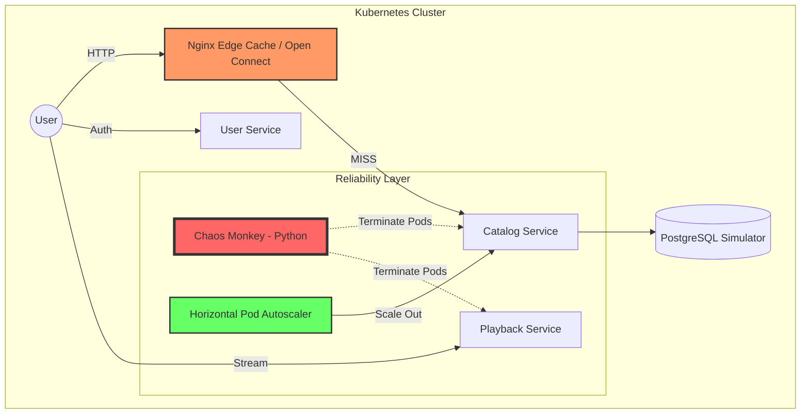

# Netflix Scale & Reliability Lab 🎬🍿

[](https://kubernetes.io)
[](https://www.docker.com)
[](https://golang.org)
[](https://www.python.org)

A high-fidelity **DevOps & Resiliency Lab** designed to study the architectural principles that allow Netflix to stream to 220M+ users. This project simulates a globally distributed system with a focus on **Self-Healing**, **Edge Caching**, and **Automated Scaling**.

---

## 🏗️ Architecture Diagram



## 🚀 Core Features

1.  **Microservices (Go)**:
    - `user-service`: Manages user metadata.
    - `catalog-service`: Serves movie data with simulated network latency.
    - `playback-service`: Generates streaming manifests with intermittent failures.
2.  **Edge Caching (Open Connect Simulator)**:
    - Nginx configured as a reverse proxy with `proxy_cache`.
    - Demonstrates how Netflix offloads 90%+ of traffic from core backends.
3.  **Chaos Engineering**:
    - Custom **Chaos Monkey** script that randomly destroys pods to test K8s self-healing.
4.  **Auto-Scaling**:
    - **HPA** manifests that scale microservices from 2 to 10 replicas based on CPU demand.

---

## 🛠️ Getting Started

### 1. Prerequisites
- Docker Desktop (with Kubernetes enabled)
- Go 1.26+
- Python 3.12+

### 2. Build & Deploy
```powershell
# Build images
cd services/user-service; docker build -t netflix-user-service:v1 .
cd ../catalog-service; docker build -t netflix-catalog-service:v1 .
cd ../playback-service; docker build -t netflix-playback-service:v1 .
cd ../edge-cache; docker build -t netflix-edge-cache:v1 .

# Deploy to K8s
kubectl apply -f k8s/services/
kubectl apply -f k8s/infrastructure/
```

### 3. Run Chaos Monkey
```powershell
cd chaos
pip install -r requirements.txt
python chaos_monkey.py
```

---

### 4. Observability (Prometheus)
- **Prometheus**: Automatically scraping metrics from all services.
- **Access**: Go to `http://localhost:9090` to query metrics.
- **Try Query**: `rate(http_request_duration_seconds_count[1m])`

## 🧪 Engineering Experiments

### Test the CDN (Edge Cache)
In PowerShell, use `curl.exe` (to avoid the Invoke-WebRequest alias):
```powershell
# First request (Cache MISS)
curl.exe -I http://localhost/movies

# Second request (Cache HIT)
curl.exe -I http://localhost/movies
```
Look for the `X-Cache-Status: HIT` header!

### Observe Self-Healing
Watch Kubernetes instantly replace pods killed by the Chaos Monkey:
```powershell
kubectl get pods -w
```

### 5. Cleanup
To stop all services and reduce resource usage (CPU/Memory):
```powershell
./scripts/cleanup.ps1
```

### Automated Snapshots
I've included a utility to capture the current state of your cluster for documentation:
```powershell
python capture_snapshots.py
```
This will save timestamped text logs of your pods, services, and HPA status into the `screenshots/` folder.

## 📊 Key Takeaways
- **Resiliency is a Design Choice**: The system stays up even when pods are being killed.
- **Edge Strategy**: Caching at the edge is the only way to scale to 220M+ users.
- **Observability**: Metrics and Health Checks (Liveness/Readiness) are critical for automated recovery.

---
*Built as a DevSecOps Engineering Study Lab.*
## 👨‍💻 Author
**Sumanth Lagadapati**  