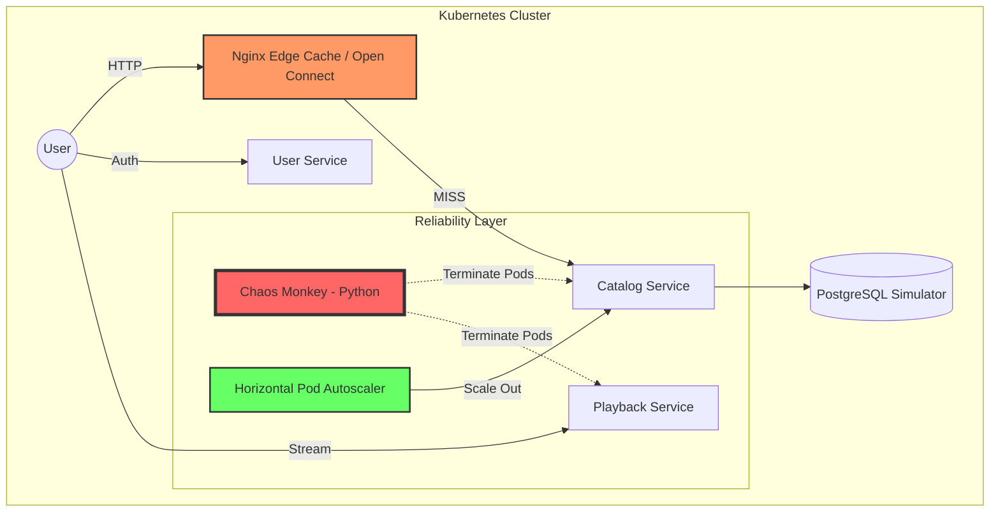

# Netflix Scale & Reliability Lab 🎬🍿

[](https://kubernetes.io)
[](https://www.docker.com)
[](https://golang.org)
[](https://www.python.org)

A high-fidelity **DevOps & Resiliency Lab** designed to study the architectural principles that allow Netflix to stream to 220M+ users. This project simulates a globally distributed system with a focus on **Self-Healing**, **Edge Caching**, and **Automated Scaling**.

---

## 🏗️ Architecture Diagram



## 🚀 Core Features

1.  **Microservices (Go)**:
    - `user-service`: Manages user metadata.
    - `catalog-service`: Serves movie data with simulated network latency.
    - `playback-service`: Generates streaming manifests with intermittent failures.
2.  **Edge Caching (Open Connect Simulator)**:
    - Nginx configured as a reverse proxy with `proxy_cache`.
    - Demonstrates how Netflix offloads 90%+ of traffic from core backends.
3.  **Chaos Engineering**:
    - Custom **Chaos Monkey** script that randomly destroys pods to test K8s self-healing.
4.  **Auto-Scaling**:
    - **HPA** manifests that scale microservices from 2 to 10 replicas based on CPU demand.

---

## 📑 Logging Behavior (catalog-service)

The `catalog-service` now supports file-based logging for all HTTP requests and events. Two logging modes are available:

### 1. Log Rotation (Default)
- Uses [lumberjack](https://github.com/natefinch/lumberjack) for automatic log rotation.
- Log file: `catalog-service.log` (in the working directory)
- Rotation settings:
  - Max size: 5MB
  - Max backups: 3
  - Max age: 28 days
  - Old logs are compressed
- Enabled by default via `main_lumberjack.go` (see Dockerfile).

### 2. Standard File Logging
- Uses Go's standard library to log to `catalog-service.log`.
- No automatic rotation; log file grows indefinitely.
- Use `main_stdlog.go` to enable this mode.

**Switching Modes:**
- By default, the Dockerfile builds and runs `main_lumberjack.go` (log rotation enabled).
- To use standard logging, change the Dockerfile build command to use `main_stdlog.go`.

**Log Output:**
- All requests to `/health`, `/metrics`, and `/movies` are logged with client IP and endpoint info.
- Log files are created in the container/app working directory.

### 🧹 Log & Generated File Cleanup
To remove log files and other generated files for all services, use the provided cleanup scripts:

- **Bash (Linux/macOS):**
  ```bash
  ./scripts/cleanup.sh
  ```
- **PowerShell (Windows):**
  ```powershell
  ./scripts/cleanup.ps1
  ```

These scripts will:
- Delete all `.log` and rotated `.log*` files in each service directory, including `catalog-service.log`, `playback-service.log`, `user-service.log`, `edge-cache.log`, and any `.log` files in the `chaos/` folder.
- Remove any other generated `.log` files (including backups) created by your services or chaos scripts.
- Clean up Kubernetes resources by deleting all services and infrastructure manifests.

**Example of what gets deleted:**
- `services/catalog-service/*.log*`
- `services/playback-service/*.log*`
- `services/user-service/*.log*`
- `services/edge-cache/*.log*`
- `chaos/*.log*`

> If you generate additional files (e.g., debug logs, custom output) in these directories, the cleanup scripts will remove them as well if they match the `.log*` pattern.

#### 🛠️ Troubleshooting Cleanup Scripts
If you encounter issues with the cleanup scripts, try the following tips:

- **Permission Denied:**
  - Make sure the scripts are executable. On Unix systems, run `chmod +x ./scripts/cleanup.sh`.
  - If running in a container or restricted environment, ensure you have permission to delete files.
- **Files Not Deleted:**
  - Check that the log files are not open or locked by a running process.
  - Make sure you are running the script from the project root directory.
  - Verify that the file patterns in the script match your generated files.
- **Script Not Found:**
  - Ensure you are using the correct relative path (`./scripts/cleanup.sh` or `./scripts/cleanup.ps1`).
- **Windows PowerShell Execution Policy:**
  - If you see a policy error, run `Set-ExecutionPolicy -Scope Process -ExecutionPolicy Bypass` in your PowerShell session before running the script.
- **Custom File Locations:**
  - If you have added new directories or changed log file locations, update the cleanup scripts to include those paths.

If problems persist, review the script output for error messages or manually delete files as needed.

---

## 🛠️ Getting Started

### 1. Prerequisites
- Docker Desktop (with Kubernetes enabled)
- Go 1.26+
- Python 3.12+

### 2. Build & Deploy
```powershell
# Build images
cd services/user-service; docker build -t netflix-user-service:v1 .
cd ../catalog-service; docker build -t netflix-catalog-service:v1 .
cd ../playback-service; docker build -t netflix-playback-service:v1 .
cd ../edge-cache; docker build -t netflix-edge-cache:v1 .

# Deploy to K8s
kubectl apply -f k8s/services/
kubectl apply -f k8s/infrastructure/
```

### 3. Run Chaos Monkey
```powershell
cd chaos
pip install -r requirements.txt
python chaos_monkey.py
```

#### Global Outage Simulation (Disaster Drill)
To simulate a global outage (terminate all Netflix service pods at once):
```powershell
python chaos_monkey.py --global-outage
```
Or, using an environment variable (lower precedence than CLI flag):
```powershell
$env:GLOBAL_OUTAGE_MODE="true"; python chaos_monkey.py
```

#### Logging Chaos Events to a File
To write all chaos events to a log file (in addition to console):
```powershell
python chaos_monkey.py --log-file chaos_events.log
```
You can combine with global outage mode:
```powershell
python chaos_monkey.py --global-outage --log-file chaos_events.log
```

##### Log Rotation
To prevent log files from growing too large, log rotation is supported:
- `--log-max-bytes`: Maximum size (in bytes) of a log file before it is rotated. Default: 5MB.
- `--log-backup-count`: Number of rotated backup log files to keep. Default: 3.

Example:
```powershell
python chaos_monkey.py --log-file chaos_events.log --log-max-bytes 1048576 --log-backup-count 5
```
This will rotate the log file every 1MB and keep up to 5 backups.

---

### 4. Observability (Prometheus)
- **Prometheus**: Automatically scraping metrics from all services.
- **Access**: Go to `http://localhost:9090` to query metrics.
- **Try Query**: `rate(http_request_duration_seconds_count[1m])`

## 🧪 Engineering Experiments

### Test the CDN (Edge Cache)
In PowerShell, use `curl.exe` (to avoid the Invoke-WebRequest alias):
```powershell
# First request (Cache MISS)
curl.exe -I http://localhost/movies

# Second request (Cache HIT)
curl.exe -I http://localhost/movies
```
Look for the `X-Cache-Status: HIT` header!

### Observe Self-Healing
Watch Kubernetes instantly replace pods killed by the Chaos Monkey:
```powershell
kubectl get pods -w
```

### 5. Cleanup
To stop all services and reduce resource usage (CPU/Memory):
```powershell
./scripts/cleanup.ps1
```

### Automated Snapshots
I've included a utility to capture the current state of your cluster for documentation:
```powershell
python capture_snapshots.py
```
This will save timestamped text logs of your pods, services, and HPA status into the `screenshots/` folder.

## 📊 Key Takeaways
- **Resiliency is a Design Choice**: The system stays up even when pods are being killed.
- **Edge Strategy**: Caching at the edge is the only way to scale to 220M+ users.
- **Observability**: Metrics and Health Checks (Liveness/Readiness) are critical for automated recovery.

---
*Built as a DevSecOps Engineering Study Lab.*
## 👨‍💻 Author
**Sumanth Lagadapati**  